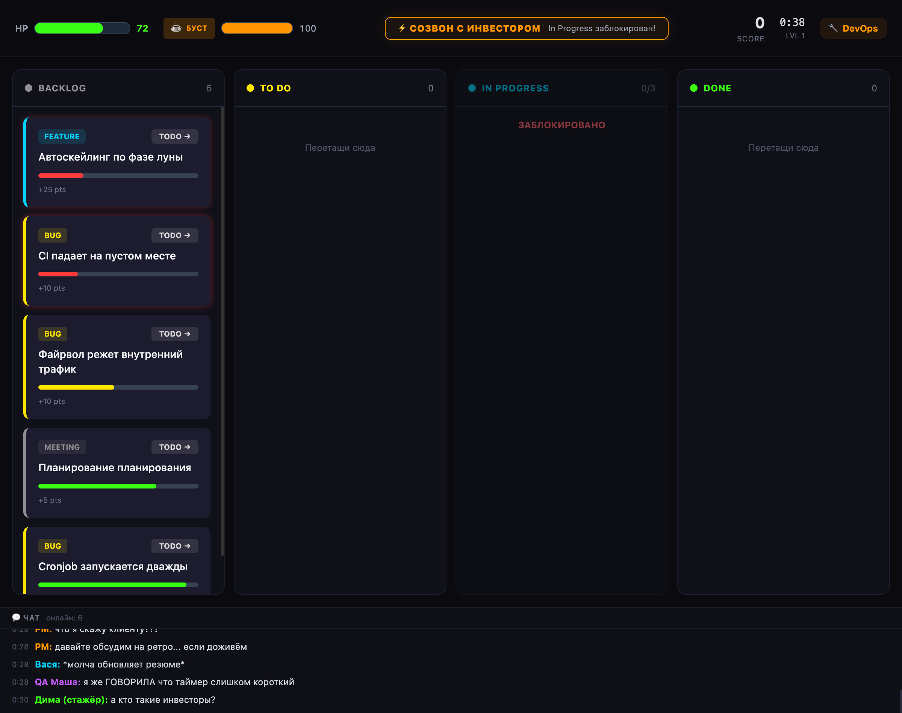

# I Kanban

> // для тех кто любит закрывать задачки ;)

Браузерная игра-симулятор канбан-доски. Задачи сыпятся на доску с нарастающей скоростью — перетаскивай их через колонки, закрывай вовремя, не дай бэклогу взорваться.

**[Играть](https://ikanban.ru)**



---

## Геймплей

Выбираешь роль (Frontend, Backend, DevOps или SRE) — и задачи начинают лететь в **Backlog**. Двигай их по доске:

```
Backlog → To Do → In Progress → Done
```

- В **In Progress** задача решается автоматически (прогресс-бар заполняется)
- Если таймер задачи истекает — она взрывается и наносит урон по HP
- HP = 0 — Game Over

### Ресурсы

| Ресурс | Описание |
|--------|----------|
| **HP** | Здоровье. Уменьшается при взрыве задач |
| **Coffee** | Восстанавливается со временем. Кнопка **БУСТ** (−20 кофе) ускоряет задачи в In Progress |
| **Combo** | Растёт за последовательные закрытия задач, множит очки |
| **Score** | Очки за закрытые задачи с учётом комбо-множителя |

### Типы задач

| Тип | Таймер | Работа | Очки | Урон | Цвет |
|-----|--------|--------|------|------|------|
| Bug | 22 сек | 3 сек | 10 | 8 | Жёлтый |
| Feature | 30 сек | 5 сек | 25 | 12 | Голубой |
| Hotfix | 12 сек | 2 сек | 30 | 15 | Красный |
| Meeting | 25 сек | 4 сек | 5 | 6 | Серый |
| Absurd | 35 сек | 6 сек | 50 | 15 | Фиолетовый |

### Роли

Роль определяет тематику задач и влияет на названия тасок:

| Роль | Специализация |
|------|---------------|
| **Frontend** | CSS, div-ы, фреймворки каждый месяц |
| **Backend** | API, базы данных, загадочные 500-ки |
| **DevOps** | Pipeline-ы, Docker, YAML-ад |
| **SRE** | Алерты, SLO, on-call в 3 ночи |

### Сложность

Сложность растёт с игровым временем:

| Уровень | Время | Интервал спавна | Доступные типы |
|---------|-------|-----------------|----------------|
| 1 | 0–60 сек | 5 сек | bug, feature, meeting |
| 2 | 60–120 сек | 3.5 сек | + hotfix |
| 3 | 120–180 сек | 2.5 сек | + absurd |
| 4 | 180+ сек | 1.2 сек | все типы |

### События

Периодически срабатывают случайные события, влияющие на игру:

| Событие | Эффект | Длительность |
|---------|--------|--------------|
| **Пятничный деплой** | Все таймеры x2 | 13 сек |
| **Созвон с инвестором** | In Progress заблокирован | 10 сек |
| **Кофемашина сломалась** | Кофе не восстанавливается | 15 сек |
| **Стажёр пушнул в main** | +3 хотфикса в бэклог | мгновенно |
| **Code Review** | Задача из Done возвращается | мгновенно |
| **Ретро** | Таймеры замедлены x0.5. Передышка | 11 сек |

---

## Архитектура

```
src/
├── components/
│   ├── Board/          # Канбан-доска, колонки, карточки задач
│   ├── Chat/           # Чат-панель с реакциями коллег
│   ├── HUD/            # HP, кофе, очки, события, музыкальный плеер
│   └── Screens/        # Стартовый экран и Game Over
├── data/
│   ├── tasks.ts        # 180+ шаблонов задач по ролям
│   ├── events.ts       # Шаблоны игровых событий
│   └── chat.ts         # Персонажи и пулы сообщений для чата
├── engine/
│   ├── useGameLoop.ts  # requestAnimationFrame game loop
│   └── audioEngine.ts  # Синглтон-аудиодвижок (6 треков)
├── store/
│   └── gameStore.ts    # Zustand: состояние, логика, тик-апдейт
├── types/
│   └── index.ts        # TypeScript типы
├── utils/
│   └── scoring.ts      # Расчёт очков и комбо
├── App.tsx             # Корневой компонент с фазами игры
├── index.css           # Глобальные стили, неоновая тема
└── main.tsx            # Точка входа
```

### Стек технологий

| Технология | Назначение |
|------------|------------|
| **React 19** | UI-компоненты |
| **TypeScript** | Типизация |
| **Vite** | Сборка и dev-сервер |
| **Zustand** | Глобальное состояние игры |
| **@dnd-kit** | Drag-and-drop задач между колонками |
| **Framer Motion** | Анимации (появление, взрывы, баннеры) |
| **Tailwind CSS 4** | Стилизация с неоновой темой |

### Ключевые решения

**Game Loop** — кастомный хук `useGameLoop` на `requestAnimationFrame` с delta-time. Каждый кадр вызывает `tickUpdate(deltaSeconds)` в Zustand store, который обновляет таймеры задач, прогресс работы, спавн, события и проверку HP.

**Drag & Drop** — реализован через `@dnd-kit/core`. Валидация перемещений: задачи двигаются только вперёд по колонкам (Backlog → To Do → In Progress → Done), WIP-лимит In Progress = 3.

**Audio Engine** — синглтон-класс вне React-дерева. Управляет `HTMLAudioElement` и хранит состояние (`playing`, `trackIdx`, `ready`). Компоненты подписываются через `useSyncExternalStore`. Это позволяет музыке играть непрерывно, даже когда UI-компоненты перемонтируются (например, при смене баннера событий).

**Чат** — реактивная панель, которая слушает изменения в store и генерирует сообщения от 6 персонажей. Реагирует на спавн задач, взрывы, завершения, комбо, низкий HP и события. Защита от дубликатов через кольцевой буфер последних 20 сообщений.

**Responsive** — адаптивный дизайн через Tailwind-брейкпоинты. На мобильных: горизонтальный скролл колонок со snap-привязкой, компактный двухрядный HUD, увеличенные кнопки для тач-управления.

---

## Как запустить локально

```bash
npm install
npm run dev
```

## Деплой

CI/CD через GitHub Actions → GitHub Pages. Push в `main` автоматически билдит и деплоит.

```yaml
# .github/workflows/deploy.yml
on:
  push:
    branches: [main]
```

---

**[Telegram: DevOps Brain](https://t.me/devopsbrain)**
